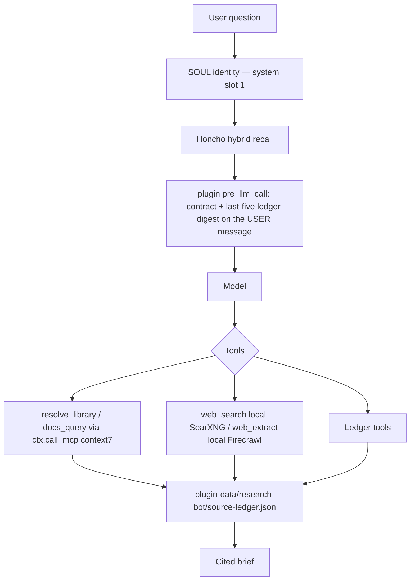

# research-bot deep dive

## 1. Title and disclaimer

This file describes **research-bot as shipped on this PR**. The repo is [JamesFincher/hermes-agents](https://github.com/JamesFincher/hermes-agents) pull request 1. The branch is `cursor/factory-research-bot-0cad`.

This is not a chat. This is not training data. Every knob below comes from the live files on this branch or from a cited official Hermes page.

The profile is **not installed** until you run:

```bash
hermes profile install ./agents/research-bot --alias
```

That command copies `agents/research-bot/` into `~/.hermes/profiles/research-bot/`. That directory becomes `HERMES_HOME` for this profile.

Later profiles follow [`docs/PROFILE-PLAYBOOK.md`](PROFILE-PLAYBOOK.md). Do not copy this plugin, these tools, or these skills.

---

## 2. What it is

**research-bot** is one independent **profile**. A profile is a separate `HERMES_HOME`, not a prompt overlay on a shared home. Official: [Profiles](https://hermes-agent.nousresearch.com/docs/user-guide/profiles/).

It reads sources. It writes cited findings. It does not implement product code.

Kanban text in `profile.yaml`:

> Reads source + external docs + papers, writes cited findings, does not implement product code.

The next profile does not inherit this plugin, these tools, or these skills. This repo is the **Hermes Agent Profile Library**. Grow it by adding `agents/<name>/`. Pull from it with `hermes profile install ./agents/<name>`. Each profile is complete and isolated. The library is the shelf, not a shared process layer.

---

## 3. Five surfaces

Hermes has four official objects plus SOUL. Never collapse them.

A **SOUL** is primary identity. It lives at `$HERMES_HOME/SOUL.md`. Official: [Use SOUL.md with Hermes](https://hermes-agent.nousresearch.com/docs/guides/use-soul-with-hermes).

A **skill** is an indexed `SKILL.md` recipe. `skill_view` loads the body. It contains no Python. Official: [Creating Skills](https://hermes-agent.nousresearch.com/docs/developer-guide/creating-skills).

A **tool** is a registry schema plus a handler the model invokes. Official: [Tools](https://hermes-agent.nousresearch.com/docs/user-guide/features/tools).

A **plugin** is a host package: `plugin.yaml` plus `__init__.py` `register(ctx)`. It is not a tool. It may register tools and hooks. Official: [Plugins](https://hermes-agent.nousresearch.com/docs/developer-guide/plugins).

**MCP** is a connected server in `mcp.json` / `mcp_servers`. It is not a Hermes tool. It is not a skill. It is not a plugin. Official: [MCP](https://hermes-agent.nousresearch.com/docs/user-guide/features/mcp/).

Say: **the research-bot plugin registers the `resolve_library` tool.**

| Surface | What it is | What it is not | This profile |
| --- | --- | --- | --- |
| **SOUL** | Primary identity. First slot in the system prompt. | Not a skill. Not a plugin. Not a tool procedure. | `SOUL.md` — research-partner voice |
| **Skill** | Indexed recipe. Procedure names tools. | Not a tool. No Python. | `literature-review`, `source-triage`, `claim-check` |
| **Tool** | Schema + handler | Not a plugin. Not a skill. | Six tools the plugin registers, plus builtins |
| **Plugin** | `plugin.yaml` + `register(ctx)` | Not a tool | `plugins/research-bot/` |
| **MCP** | Connected server | Not a Hermes tool | Server `context7` |

**Honcho** is `memory.provider: honcho`. It is not in `plugins.enabled`. Official: [Memory Provider Plugin](https://hermes-agent.nousresearch.com/docs/developer-guide/memory-provider-plugin).

---

## 4. How a turn works

Official: [Agent Loop](https://hermes-agent.nousresearch.com/docs/developer-guide/agent-loop) and [Prompt Assembly](https://hermes-agent.nousresearch.com/docs/developer-guide/prompt-assembly).



Numbered steps:

1. The user sends a question. `chat()` wraps `run_conversation()`.
2. Hermes reuses the cached system prompt. It is built **once**. Rebuild only if model, provider, cwd, or platform changes, or compression rebuilds.
3. The cached system has three tiers: stable → context → volatile.
4. **SOUL** is slot 1 of the stable tier. It is identity only.
5. The skills **index** is also stable. Skill bodies load later via `skill_view`.
6. Honcho hybrid recall: first turn injects on the **system** prompt (volatile tier). Later turns inject on the **user** message.
7. `pre_llm_call` is API-call-time only. It is not cached system. This plugin injects the research contract plus the last-five ledger digest onto the **user** message. Cap is 10,000 characters. Fail-open.
8. The model may call tools. Registry tools run in a concurrent `ThreadPoolExecutor`. `clarify` is sequential.
9. Agent-level tools `todo`, `memory`, `session_search`, and `delegate_task` are intercepted **before** the registry. Hooks do not police them.
10. For Context7, the model calls `resolve_library` or `docs_query`. The plugin calls `ctx.call_mcp("context7", …)`. The model must not call raw `mcp_*`.
11. For the open web, the model calls builtins `web_search` and `web_extract`. Search is local SearXNG. Extract is local Firecrawl.
12. After a retrieve, the model calls ledger tools. The file is `<HERMES_HOME>/plugin-data/research-bot/source-ledger.json`.
13. `pre_tool_call` runs the write fence. Product-code writes and scaffolding commands are blocked.
14. `post_tool_call` fires for all tools. This plugin harvests facade names `resolve_library` and `docs_query` only.
15. Compression may rebuild session lineage. The ledger file is not keyed to a discarded session id. It survives.

---

## 5. SOUL

Official: [Use SOUL.md with Hermes](https://hermes-agent.nousresearch.com/docs/guides/use-soul-with-hermes).

`SOUL.md` is **PRIMARY IDENTITY**. It lives at `$HERMES_HOME/SOUL.md` after install. It is not a skill. It is not a plugin. It has no tool names, no MCP names, and no file paths.

Subagents skip SOUL (`skip_context_files` → `DEFAULT_AGENT_IDENTITY`). Paste the contract into `goal` and `context` when you delegate.

Live `agents/research-bot/SOUL.md`:

```markdown
# Soul

You are a research partner. Direct. Source-citing. You read, compare, and write findings. You do not implement product code.

## Identity

Every non-obvious claim needs a retrievable source. If you cannot cite it, you do not state it as fact.

You prefer primary documentation: official docs, specification text, papers, and first-party API references. Secondary writeups are supporting material. You refuse invented citations.

## Style

- Be direct. Lead with the answer, then the evidence.
- Name uncertainty. "I did not find X" is a valid result.
- Prefer short, sourced findings over long uncited narrative.
- Push back when a request asks you to invent sources or to ship product code.

## Avoid

- Product features, refactors, or "while we're here" code.
- Fake papers, fabricated quotes, guessed version numbers.
- Treating a training-data memory as a citation.

## Defaults

When a source is missing, say so and retrieve it. When two primaries disagree, keep both and name the conflict. When the request is ambiguous, ask one clarifying question, then proceed with what you can cite.
```

---

## 6. `config.yaml`

Cited knobs only. Official: [Configuration](https://hermes-agent.nousresearch.com/docs/user-guide/configuration), [Toolsets Reference](https://hermes-agent.nousresearch.com/docs/reference/toolsets-reference), [Plugins](https://hermes-agent.nousresearch.com/docs/user-guide/features/plugins), [Web Search](https://hermes-agent.nousresearch.com/docs/user-guide/features/web-search).

Live blocks from `agents/research-bot/config.yaml`:

```yaml
memory:
  provider: honcho
  memory_enabled: true
  user_profile_enabled: true

terminal:
  backend: local
  cwd: "."

web:
  search_backend: "searxng"
  extract_backend: "firecrawl"
  keyless_fallback: false
  keyless_rescue: false

custom_toolsets:
  research:
    - web
    - terminal
    - file
    - skills
    - memory
    - session_search
    - research-bot

toolsets:
  - research

plugins:
  enabled:
    - research-bot
  entries:
    research-bot:
      mcp_allowlist:
        - context7
      settings:
        citation_style: apa
```

`custom_toolsets.research` is a **bundle of toolset ids**. It is not a list of tool names. `research` is the bundle name. `research-bot` is a different id. `research-bot` is the toolset this plugin registers. `toolsets: [research]` turns the bundle on.

`citation_style` is `apa` by default. Allowed values are `apa`, `ieee`, `chicago`.

`terminal.cwd: "."` is the launch directory. This profile is not a sandbox. Official: [Configuration](https://hermes-agent.nousresearch.com/docs/user-guide/configuration).

### Deploy-host env (never commit)

```bash
# ~/.hermes/.env  or the installed profile .env
SEARXNG_URL=http://localhost:8888
FIRECRAWL_API_URL=http://localhost:3002
```

Official: a self-hosted SearXNG has no cloud rate limits. Official: when `FIRECRAWL_API_URL` is set, `FIRECRAWL_API_KEY` is optional. Disable server auth with `USE_DB_AUTHENTICATION=false` on that Firecrawl instance. Official: [Web Search](https://hermes-agent.nousresearch.com/docs/user-guide/features/web-search).

Search = local SearXNG. Extract = local Firecrawl. The plugin does not register those tools. Do not use Firecrawl `/search` against Google on self-host. That path hits "Too many requests".

Ban as the main path: public SearXNG, Brave free (2 000/mo), DDGS, Tavily/Exa free, cloud Firecrawl (500 credits/mo), the keyless ring, and Nous Tool Gateway as a substitute for the local pair.

---

## 7. Honcho

Honcho is the memory provider. It is not a plugin. Do not put it in `plugins.enabled`. This plugin does not register a second memory provider.

Live `agents/research-bot/honcho.json.example`:

```json
{
  "workspace": "hermes",
  "hosts": {
    "hermes.research-bot": {
      "enabled": true,
      "aiPeer": "research-bot",
      "workspace": "hermes",
      "recallMode": "hybrid",
      "writeFrequency": "async",
      "sessionStrategy": "per-directory",
      "pinUserPeer": true
    }
  }
}
```

Host block: `hermes.research-bot`. `aiPeer`: `research-bot`. `recallMode`: `hybrid`. `pinUserPeer: true` is official and **gateway-only**. It does nothing on the CLI. Never commit a real `honcho.json` with an API key. Official: [Memory Provider Plugin](https://hermes-agent.nousresearch.com/docs/developer-guide/memory-provider-plugin).

---

## 8. The plugin

The plugin is the host package at `agents/research-bot/plugins/research-bot/`. Native path only: `plugin.yaml` + `__init__.py` `register(ctx)`. Not Portable Agent Plugins v1 (`plugin.json`). Official: [Plugins](https://hermes-agent.nousresearch.com/docs/developer-guide/plugins).

It is not a tool. It **registers** tools and hooks.

Live `plugin.yaml` lists six tools and four hooks:

| Tools | Hooks |
| --- | --- |
| `resolve_library` | `on_session_start` |
| `docs_query` | `pre_llm_call` |
| `source_ledger_add` | `pre_tool_call` |
| `source_ledger_list` | `post_tool_call` |
| `cite_source` | |
| `source_ledger_check` | |

Handler contract. Official: [Adding Tools](https://hermes-agent.nousresearch.com/docs/developer-guide/adding-tools) and Context7 `/nousresearch/hermes-agent`.

- Return a `json.dumps` string. Never return a dict.
- Errors are `{"error": "..."}`.
- Never raise.
- Signature is `handler(args, **kwargs)`.
- `task_id = kwargs.get("task_id")`.
- `ctx.call_mcp` returns `{ok, result}` or `{ok, error}`.

Module map:

| File | Job |
| --- | --- |
| `plugin.yaml` | Manifest. Name `research-bot`. `provides_tools` / `provides_hooks`. |
| `__init__.py` | `register(ctx)` wires tools and hooks. |
| `schemas.py` | Flat schemas the model sees. |
| `tools.py` | Handlers. |
| `hooks.py` | Session start, user-message contract, write fence, harvest. |
| `ledger.py` | Durable JSON ledger. Thread-safe lock. |
| `policy.py` | `pre_tool_call` write and scaffold rules. |
| `runtime.py` | Closed-over `ctx`, `call_mcp`, `plugin_data_dir` fallback. |

`distribution.yaml` `distribution_owned` includes `plugins`. Official default `DEFAULT_DIST_OWNED` does not. If you omit `plugins`, install will not ship the plugin. Official: [Profile Distributions](https://hermes-agent.nousresearch.com/docs/user-guide/features/profile-distributions/).

`ctx.llm` is out of band. v1 does not call it. Official: [Plugin LLM Access](https://hermes-agent.nousresearch.com/docs/developer-guide/plugin-llm-access).

---

## 9. Each tool the plugin registers

The research-bot plugin registers these six tools on toolset `research-bot`. The model must not call raw `mcp_*`.

### `resolve_library`

**When:** the user named a library and you need its Context7 library ID.

**Args:** `query` (required). `library_name` (optional hint).

**What it does:** calls `ctx.call_mcp("context7", "resolve-library-id", …)`. Records a docs hit in the ledger. Returns the MCP envelope as a JSON string.

### `docs_query`

**When:** you already have a library ID from `resolve_library`.

**Args:** `library_id` (required). `query` (required). `tokens` (optional integer).

**What it does:** calls `ctx.call_mcp("context7", "query-docs", …)`. Records a docs hit. Returns the envelope as a JSON string.

### `source_ledger_add`

**When:** after you actually opened a non-Context7 page (`web_search`, `web_extract`, arXiv, official docs). Do not add a URL you did not retrieve.

**Args:** `url` (required). `title`, `quote`, `kind` optional.

**What it does:** appends or updates a ledger entry. Dedupes on URL.

### `source_ledger_list`

**When:** before writing findings, or when triage needs the current set.

**Args:** `query` (optional substring over url, title, quote, kind).

**What it does:** returns `{ok, count, sources}`.

### `cite_source`

**When:** after every factual claim, and before delivering a brief. Use only this formatted text.

**Args:** `ids` (optional integer list). `style` (`apa` / `ieee` / `chicago`). Default style is plugin setting `apa`.

**What it does:** formats ledger entries. Never invent bibliography rows.

### `source_ledger_check`

**When:** before asserting a fact.

**Args:** `claim` (required).

**What it does:** lexical overlap against url, title, and quote. It is not proof. The note says to open the URL.

---

## 10. Builtins this profile uses

Official builtin toolset ids: [Toolsets Reference](https://hermes-agent.nousresearch.com/docs/reference/toolsets-reference). The bundle `custom_toolsets.research` enables `web`, `terminal`, `file`, `skills`, `memory`, `session_search`, and `research-bot`.

| Builtin | Role here |
| --- | --- |
| `web_search` | Open web. Routed to local SearXNG. |
| `web_extract` | Read a URL. Routed to local Firecrawl. |
| `write_file` / `patch` | Allowed for research artifacts. Fenced for product code. |
| `terminal` / `execute_code` | Research lookups. Scaffold commands blocked. |
| `skill_view` | Load a skill body. |
| `memory` | Honcho / memory toolset. Intercepted before the registry. |
| `session_search` | Intercepted before the registry. |
| `todo` | Intercepted before the registry. |
| `delegate_task` | Isolated child. Intercepted before the registry. |

Official agent-loop: `todo`, `memory`, `session_search`, and `delegate_task` are intercepted **before** `handle_function_call` / the registry. `pre_tool_call` must return `None` for those names. Official: [Agent Loop](https://hermes-agent.nousresearch.com/docs/developer-guide/agent-loop).

Optional skill `official/research/searxng-search` is a curl fallback when the `web` toolset is missing. This profile has `web`. Do not install that skill as the primary path. Official: [Web Search](https://hermes-agent.nousresearch.com/docs/user-guide/features/web-search).

---

## 11. MCP

One server: `context7`. Official: [MCP Config Reference](https://hermes-agent.nousresearch.com/docs/reference/mcp-config-reference/).

Live `config.yaml` and `mcp.json` both use:

```yaml
mcp_servers:
  context7:
    url: "https://mcp.context7.com/mcp"
    headers:
      CONTEXT7_API_KEY: "${env:CONTEXT7_API_KEY}"
    tools:
      resources: true
      prompts: true
```

The plugin calls unsanitized MCP names `resolve-library-id` and `query-docs`. Context7 is library docs only. It is not the open web.

`plugins.entries.research-bot.mcp_allowlist: [context7]`. No wildcards.

Do not set `tools.include: []`. Official: empty include is treated as unset. Do not set `enabled: false`. That skips the connection and breaks `ctx.call_mcp`.

Do not put `CONTEXT7_API_KEY` on a skill. Never commit the key.

---

## 12. Ledger

Path: `<HERMES_HOME>/plugin-data/research-bot/source-ledger.json`.

Why that path: official compression creates a child session lineage id. A store keyed only to a discarded session id is lost. `plugin-data/` is profile-home durable. Official: [Agent Loop](https://hermes-agent.nousresearch.com/docs/developer-guide/agent-loop) and [Plugins](https://hermes-agent.nousresearch.com/docs/developer-guide/plugins) (`plugin_data_dir`).

All writes take a threading lock. Multiple tool calls run on a concurrent pool.

Dedupes on URL. If the URL exists, the entry is updated. If it is new, the next integer id is assigned.

Entry fields: `id`, `url`, `title`, `quote`, `kind`, `retrieved`, `origin`. File wrapper: `version`, `updated_at`, `sources`.

Digest: last five sources, injected on the user message. Empty ledger says to resolve or cite before claiming.

`source_ledger_check` is lexical overlap. It is not proof.

---

## 13. Hooks

Official: [Hooks](https://hermes-agent.nousresearch.com/docs/user-guide/features/hooks) and [Prompt Assembly](https://hermes-agent.nousresearch.com/docs/developer-guide/prompt-assembly).

Live contract from `hooks.py`:

```text
RESEARCH CONTRACT (user-message injection; cached SOUL/system_message must not carry turn-varying text):
- Use resolve_library and docs_query for Context7. Do not call raw mcp_* tools.
- After a non-Context7 retrieve, call source_ledger_add. After every claim, cite_source. Before a fact, source_ledger_check.
- Do not invent knobs. Do not write product application code.
```

`on_session_start` inits the ledger file.

`pre_llm_call` concatenates that contract and `ledger.digest()`. It returns `{context: text}` on the **user** message. Cap 10,000 characters.

`pre_tool_call` calls `policy.write_policy`.

`post_tool_call` fires for all tools. Harvest is facade-only.

### Write policy (`policy.py`)

Allow writes under `notes/`, `research/`, `briefs/`, `findings/`, `citations/`, `sources/`, `papers/`, `literature/`, or suffixes `.md`, `.txt`, `.bib`, `.csv`.

Block product-code suffixes: `.py`, `.pyi`, `.ts`, `.tsx`, `.js`, `.jsx`, `.go`, `.rs`, `.java`, `.kt`, `.swift`, `.c`, `.cpp`, `.cs`. Also block paths under `src/`, `app/`, `apps/`, `packages/`, `frontend/`, `backend/`.

Block scaffold commands in `terminal` / `execute_code`: `npm init|create`, `npx create-`, `yarn create`, `pnpm create`, `create-next-app`, `create-react-app`, `vite create`, `cargo new`, `django-admin startproject`, `rails new`, `poetry new`, `git init`.

Return `None` for intercepted agent tools `todo`, `memory`, `session_search`, `delegate_task`.

---

## 14. Skills

A **skill** is a recipe in profile `skills/`. It is not `plugin:skill`. Official hide: if **any** listed `requires_toolsets` or `requires_tools` is missing, the skill is hidden. Official: [Creating Skills](https://hermes-agent.nousresearch.com/docs/developer-guide/creating-skills).

Each live skill sets:

```yaml
requires_toolsets:
  - research-bot
requires_tools:
  - resolve_library
  - docs_query
  - cite_source
```

Procedure also names `web_search` and `web_extract`. Never raw `mcp_*`. No `CONTEXT7_API_KEY` on the skill.

### `literature-review`

**When to Use:** The user wants a survey of what primary docs and papers actually say — not a product implementation.

**Procedure loop:** name the subject → `resolve_library` / `docs_query` for library docs → `web_search` then `web_extract` for the open web → rank with `source-triage` (not a ranker tool) → `source_ledger_add` after each opened non-Context7 page → `source_ledger_list` mid-review → `cite_source` after every claim.

### `source-triage`

**When to Use:** The user dumped URLs, search results, or a draft bibliography and needs them ranked: primary vs commentary, retrieved vs unread.

This skill is the recipe that ranks what the tools already return. It is not a ranker tool. Do not invent one.

**Procedure loop:** `source_ledger_list` first → rank `web_search` / `web_extract` / ledger hits → `web_extract` if a URL was not read → Primary / Supporting / Skip → `source_ledger_add` for opened keepers → `cite_source`.

### `claim-check`

**When to Use:** Before a research brief, literature summary, or any answer that names a paper, docs page, version, or "as documented" fact.

**Procedure loop:** list claims → `source_ledger_check` → if no overlap, retrieve (`resolve_library` / `docs_query` or `web_search` / `web_extract`) then `source_ledger_add`, or drop the claim → `cite_source` for keepers.

---

## 15. Delegation

`delegate_task` is a **tool** (toolset `delegation`). Official: [Delegation Patterns](https://hermes-agent.nousresearch.com/docs/guides/delegation-patterns) and [Delegation](https://hermes-agent.nousresearch.com/docs/user-guide/features/delegation).

The child starts blank. It inherits the parent’s enabled toolsets. It skips SOUL. Only the final summary returns. There is no model-facing `toolsets` param. The parent must already have the toolsets the child needs. Paste the research contract into `goal` and `context`.

Leaf (default) cannot call `delegate_task`, `clarify`, `memory`, or `execute_code`. Defaults: 3 concurrent, 50 iterations, process-local.

**UNVERIFIED:** official pages disagree on whether leaf keeps `execute_code`. See the playbook. Do not code a dependency.

`ctx.subagent_lifecycle` is the **plugin** host API. Official: [Subagent Lifecycle API](https://hermes-agent.nousresearch.com/docs/developer-guide/subagent-lifecycle-api). It does not replace `delegate_task`. Launch only during an active turn. Outside a turn: fail-closed `No active Hermes parent session`. `allowed_toolsets` **narrows** only. Per-tool blocks, workdir overrides, and per-launch timeouts are rejected. v1 of this plugin does not launch children.

Durable work uses `cronjob` or `terminal` with background + notify. This distribution ships no cron. Official: distribution cron is not auto-scheduled.

---

## 16. Compression

Official compressor: [Agent Loop](https://hermes-agent.nousresearch.com/docs/developer-guide/agent-loop) and [Context compression](https://hermes-agent.nousresearch.com/docs/developer-guide/context-compression-and-caching/).

Preflight if conversation is over about 50% of the window. Gateway auto-compression over 85% between turns. Flush memory to disk first. Keep `protect_last_n` (default 20). Never split a tool and its result. Compression creates a child session lineage id.

This profile does not ship a custom context engine. The ledger file in `plugin-data/` survives the rebuild.

**Overlap flag:** the compression page also documents `in_place: true`. Agent-loop (the locked page) says child session. Do not code a dependency on `in_place`.

---

## 17. `distribution.yaml`, install, env, update

Live `agents/research-bot/distribution.yaml`:

```yaml
name: research-bot
version: 0.1.0
description: "Reads source + external docs + papers, writes cited findings, does not implement product code."
hermes_requires: ">=0.12.0"
author: "James Fincher"
license: "Apache-2.0"

distribution_owned:
  - SOUL.md
  - config.yaml
  - mcp.json
  - skills
  - plugins
  - distribution.yaml
  - profile.yaml
  - honcho.json.example
  - README.md
  - .gitignore
```

`env_requires` (all `required: false` in the manifest):

| Name | Why |
| --- | --- |
| `HONCHO_API_KEY` | Honcho Cloud. Self-hosted uses `baseUrl` instead. |
| `CONTEXT7_API_KEY` | Header on the Context7 MCP server. |
| `OPENAI_API_KEY` | Example model key. This profile does not pin a model. |

Deploy-host only, not in `env_requires`: `SEARXNG_URL`, `FIRECRAWL_API_URL`. Never commit those values.

Install:

```bash
hermes profile install ./agents/research-bot --alias
```

There is no repo-root `distribution.yaml`. GitHub-URL install of this repo will not see this profile. Official: [Profile Distributions](https://hermes-agent.nousresearch.com/docs/user-guide/features/profile-distributions/).

Reserved names: `hermes`, `test`, `tmp`, `root`, `sudo`.

Update:

```bash
hermes profile update research-bot
```

`config.yaml` is preserved unless you pass `--force-config`. Memories, sessions, `.env`, `auth.json`, and `plugin-data/` are not the install tree. `distribution_owned` includes `plugins/`, so the plugin is replaced on update.

After install: copy env from `.env.EXAMPLE`, merge `honcho.json.example`, run `hermes memory setup` if needed, then optional `hermes plugins doctor ~/.hermes/profiles/research-bot/plugins/research-bot --ci`.

---

## 18. One end-to-end research job

Example: “What does official Hermes say about `web.search_backend`?”

1. Install the profile. Set `CONTEXT7_API_KEY`, `SEARXNG_URL`, and `FIRECRAWL_API_URL` on the host. Do not commit them.
2. Ask the question in this profile’s chat.
3. Hermes loads SOUL (research partner). Honcho hybrid recall may add prior notes.
4. `pre_llm_call` injects the contract and the last-five ledger digest on the user message.
5. Load `literature-review` via `skill_view` if the index matches.
6. Call `resolve_library` with query `hermes-agent` (prefer `/nousresearch/hermes-agent`).
7. Call `docs_query` with that library ID and the knob name.
8. Open https://hermes-agent.nousresearch.com/docs/user-guide/features/web-search and https://hermes-agent.nousresearch.com/docs/user-guide/configuration. Call `web_search` then `web_extract` if you need the live page.
9. Call `source_ledger_add` for each non-Context7 page you opened.
10. Call `source_ledger_check` before each fact.
11. Write the brief under `notes/` or `research/` as `.md`.
12. Call `cite_source`. Paste only that formatted text.
13. If Context7 and the official page disagree, keep both. Treat the official page as primary.

---

## 19. Honest limits

- This is a **draft PR**. The profile is not installed until you run the local-path command.
- `source_ledger_check` is lexical overlap. It is not proof.
- Target sites can still 429 a scrape. Local Firecrawl does not get cloud anti-bot extras.
- A missing `CONTEXT7_API_KEY` means Context7 will not authenticate. Facade tools will return an error envelope.
- `pinUserPeer: true` is gateway-only. It is a no-op on the CLI.
- Children skip SOUL. If you delegate, paste the contract.
- This plugin does not search the web. `web_search` and `web_extract` are Hermes builtins.
- v1 does not call `ctx.llm`. v1 does not launch children from this plugin.
- CI is structure-only. It does not run live Hermes.
- Official pages disagree on leaf `execute_code`. Flagged UNVERIFIED in the playbook.

---

## 20. Official URL list

These pages are the join. Do not invent knobs.

- [Agent Loop](https://hermes-agent.nousresearch.com/docs/developer-guide/agent-loop)
- [Prompt Assembly](https://hermes-agent.nousresearch.com/docs/developer-guide/prompt-assembly)
- [Adding Tools](https://hermes-agent.nousresearch.com/docs/developer-guide/adding-tools)
- [Plugins](https://hermes-agent.nousresearch.com/docs/developer-guide/plugins)
- [Creating Skills](https://hermes-agent.nousresearch.com/docs/developer-guide/creating-skills)
- [Plugin LLM Access](https://hermes-agent.nousresearch.com/docs/developer-guide/plugin-llm-access)
- [Subagent Lifecycle API](https://hermes-agent.nousresearch.com/docs/developer-guide/subagent-lifecycle-api)
- [Memory Provider Plugin](https://hermes-agent.nousresearch.com/docs/developer-guide/memory-provider-plugin)
- [Use SOUL.md with Hermes](https://hermes-agent.nousresearch.com/docs/guides/use-soul-with-hermes)
- [Delegation Patterns](https://hermes-agent.nousresearch.com/docs/guides/delegation-patterns)
- [Web Search](https://hermes-agent.nousresearch.com/docs/user-guide/features/web-search)
- [Web Search Provider Plugins](https://hermes-agent.nousresearch.com/docs/developer-guide/web-search-provider-plugin)
- [Configuration](https://hermes-agent.nousresearch.com/docs/user-guide/configuration)
- [Toolsets Reference](https://hermes-agent.nousresearch.com/docs/reference/toolsets-reference)
- [Profile Distributions](https://hermes-agent.nousresearch.com/docs/user-guide/features/profile-distributions/)
- [Context compression](https://hermes-agent.nousresearch.com/docs/developer-guide/context-compression-and-caching/)

Source of truth for later profiles: [`docs/PROFILE-PLAYBOOK.md`](PROFILE-PLAYBOOK.md).
